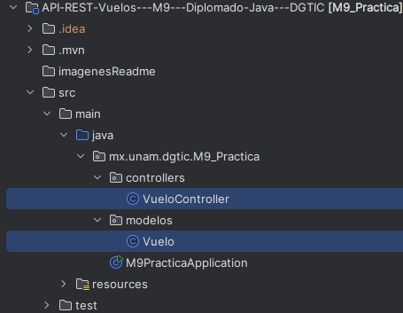
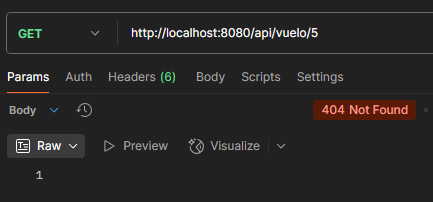
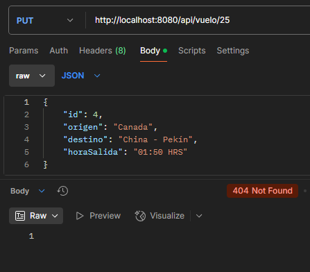
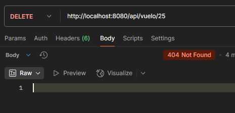

# API-REST-Vuelos---M9---Diplomado-Java---DGTIC

- [Objetivo](#objetivo)
- [Instrucciones](#instrucciones)
- [Resultados](#resultados)
  - [Directorios y archivos](#directorios-y-archivos)
  - [Entidad](#entidad)
  - [Rutas de operaciones CRUD + Pruebas](#rutas-de-operaciones-crud--pruebas)
    - [GET](#get)
    - [POST](#post)
    - [PUT](#put)
    - [PATCH](#patch)
    - [DELETE](#delete)
    - [GET - NOT FOUND - 404](#get---not-found---404)
    - [PUT - NOT FOUND - 404](#put---not-found---404)
    - [DELETE - NOT FOUND - 404](#delete---not-found---404)

Ejemplo básico de API REST utilizando Spring Boot.

## Objetivo

Aplicar los conceptos de Spring Boot para construir, desde cero, un sistema que permita gestionar
entidades de su elección (como por ejemplo: películas, videojuegos, música, deportes, entre otros).

## Instrucciones

1. __Definición de Entidades__
    * Definir al menos 3 atributos para la entidad principal (pueden agregar más
      si lo consideran necesario).
2. __Implementación del Proyecto__
    * __Inicialización del Proyecto Spring Boot__.
        * Usen Spring Initializr (https://start.spring.io/) para crear el proyecto base. Incluir las
          siguientes dependencias:
            * Spring Web para construir la API REST
            * (Opcional) Spring DevTools para facilitar el desarrollo.
        * Configuren correctamente las estructuras de paquetes y creen una clase principal que inicie
          la aplicación.
    * __Controlador REST:__
        * Creen un controlador anotado con @RestController para gestionar las rutas de su API
        * Definan las rutas básicas para las operaciones CRUD
            * __GET__: Obtener todas las entidades y obtener una por su ID.
            * __POST__: Agregar una nueva entidad.
            * __PUT__: Reemplazar completamente una entidad existente por su ID.
            * __PATCH__: Actualizar parcialmente una entidad existente.
            * __DELETE__: Eliminar una entidad por su ID.
    * __Simulación de Base de Datos__:
        * Utilicen una colección como HashMap o List para simular el almacenamiento de las
          entidades.
        * Inicialicen algunos datos en el constructor del controlador para facilitar las pruebas.
3. __Requerimientos Técnicos__:
    * __ID Autogenerado__: Al agregar una nueva entidad, deberán implementar una lógica para generar un ID
      único de manera similar a lo que se vio en el ejemplo de "librería"
    * __Validaciones__: Implementen validaciones básicas para los atributos de las entidades (por ejemplo, que
      el título no sea nulo).
    * __Manejo de Errores__: Asegúrense de manejar casos en los que una entidad no se encuentre (ej.,
      devolver un 404 Not Found si se solicita un ID que no existe).
4. __Pruebas__:
    * Probar la API con herramientas como Postman o curl para asegurarse de que todos los métodos
      funcionan correctamente.
    * Asegúrense de probar tanto casos exitosos como fallidos (ej., agregar un nuevo recurso, buscar uno
      inexistente, eliminar uno).


## Resultados

### Directorios y archivos

Una vez que se creó el proyecto junto con los paquetes indicados, se crearón los directorios __controllers__ y __modelos__, 
y dentro de estos se crearon los archivos __VueloController__ y __Vuelo__ respectivamente. La siguiente
imagen muestra la estructura de los archivos y directorios.



### Entidad

La entidad creada se llamó __Vuelo__ y contiene los siguiente datos:

| __vuelo__   | __tipo de dato__ |
|-------------|------------------|
| id          | Integer          |
| origen      | String           |
| destino     | String           | 
| horaSalida  | String           |

Esta entidad se encuentra en:

    modelos → Vuelo.cs

### Rutas de operaciones CRUD + Pruebas

Las funciones para realizar las operaciones CRUD se encuentran en:

    controllers → VueloController.cs

#### GET
  * __Buscar todos los VUELOS__

    * URL: http://localhost:8080/api/vuelo/
    * Función:

    ```csharp
    @GetMapping(value = "/", headers = {"Accept=application/json"},
            produces = MediaType.APPLICATION_JSON_VALUE)
    public ResponseEntity<HashMap<Integer, Vuelo>> getAll()
    ```    
    
    * Resultado en POSTMAN:

    


  * __Buscar VUELO por id__

    * URL: http://localhost:8080/api/vuelo/{id}
    * Función:

    ```csharp
    @GetMapping("/{id}")
    public ResponseEntity<Vuelo> getVuelo(@PathVariable Integer id)
    ```

    * Resultado en POSTMAN:
    
    

#### POST
* URL: http://localhost:8080/api/vuelo/
* Función:

  ```csharp
    @PostMapping(value = "/", produces = MediaType.APPLICATION_JSON_VALUE)
    public ResponseEntity<Vuelo> addbook(@RequestBody Vuelo vuelo)
  ```

* Resultado en POSTMAN:

    

#### PUT
* URL: http://localhost:8080/api/vuelo/{id}
* Función:

  ```csharp
    @PutMapping("/{id}")
    public ResponseEntity<Vuelo> actualizarVuelo(@PathVariable Integer id, @RequestBody Vuelo vuelo)
  ```

* Resultado en POSTMAN:

  

#### PATCH
* URL: http://localhost:8080/api/vuelo/{id}
* Función:

  ```csharp
    @PatchMapping("/{id}")
    public ResponseEntity<Vuelo> actualizarParcial(@PathVariable Integer id, @RequestBody Vuelo vuelo)
  ```

* Resultado en POSTMAN:

  

#### DELETE
* URL: http://localhost:8080/api/vuelo/{id}
* Función:

  ```csharp
    @DeleteMapping("/{id}")
    public ResponseEntity<Vuelo> eliminarVuelo(@PathVariable Integer id)
  ```

* Resultado en POSTMAN:

  

#### GET - NOT FOUND - 404

El error 404 será mostrado cuando se intente buscar un VUELO por ID que no exista

* URL: http://localhost:8080/api/vuelo/{id}  El {id} debe ser un elemento que no existe
* Función:

  ```csharp
    @GetMapping("/{id}")
    public ResponseEntity<Vuelo> getVuelo(@PathVariable Integer id)
  ```

* Resultado en POSTMAN:

  

#### PUT - NOT FOUND - 404

El error 404 será mostrado cuando se intente editar un VUELO por ID que no exista

* URL: http://localhost:8080/api/vuelo/{id}  El {id} debe ser un elemento que no existe
* Función:

  ```csharp
    @PutMapping("/{id}")
    public ResponseEntity<Vuelo> actualizarVuelo(@PathVariable Integer id, @RequestBody Vuelo vuelo)
  ```

* Resultado en POSTMAN:

  

#### DELETE - NOT FOUND - 404

El error 404 será mostrado cuando se intente eliminar un VUELO por ID que no exista

* URL: http://localhost:8080/api/vuelo/{id}  El {id} debe ser un elemento que no existe
* Función:

  ```csharp
    @DeleteMapping("/{id}")
    public ResponseEntity<Vuelo> eliminarVuelo(@PathVariable Integer id)
  ```

* Resultado en POSTMAN:

  
